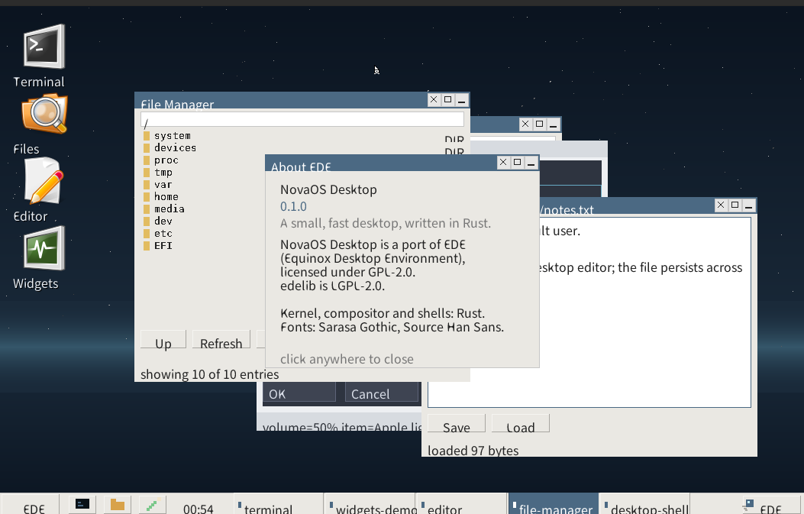
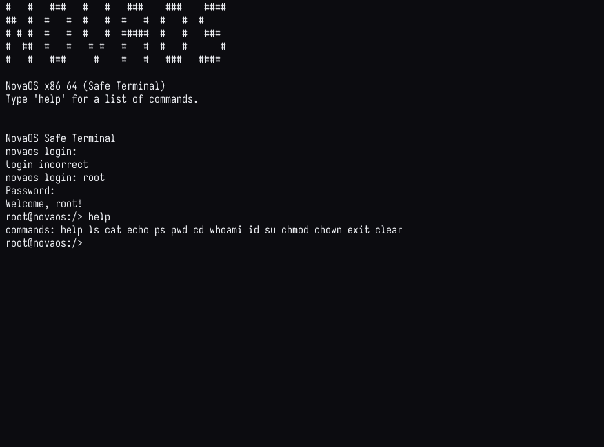
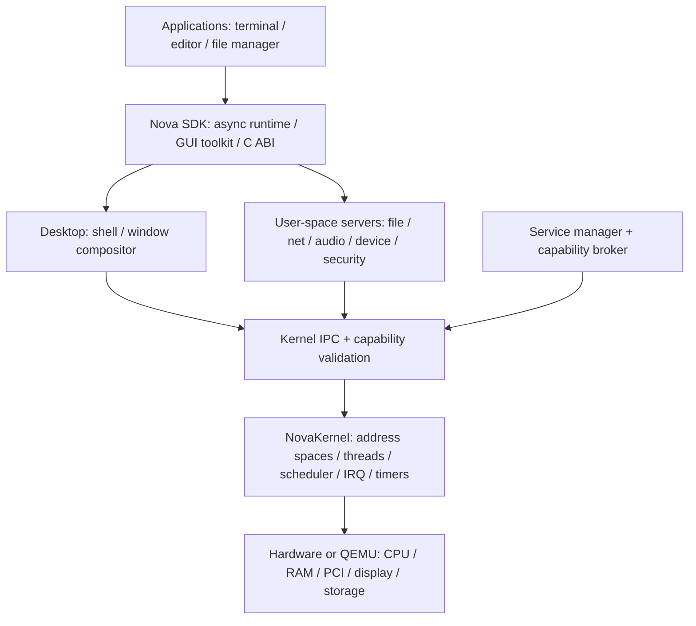
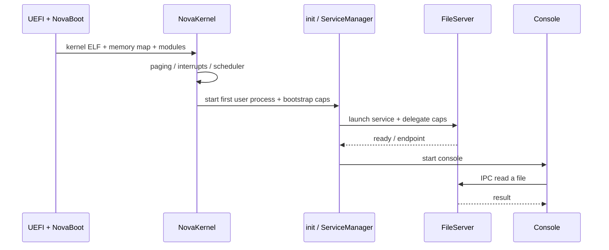

# NovaOS

**An experimental Rust-based desktop operating system featuring a lightweight microkernel, capability-based security, and modular user-space services.**

> ✅ **Status: bootable in QEMU (M0–M8).** The kernel boots under UEFI/OVMF, runs its in-kernel suites, and reaches the implemented desktop, network, and SMP paths. The desktop is a port of [EDE, the Equinox Desktop Environment](https://github.com/edeproject/ede), to Rust — it renders through a GPU-driven scanout at 1024x768 (and adapts to the mode the virtio-gpu reports), with the real EDE look and feel: the start menu, panel, window chrome, and interaction model. It is still an experimental system, not a production desktop: IPv6, package management, audio, user accounts, and real-hardware support are not implemented. TCP, ICMP, DHCP, and a bounded socket API are implemented for the emulated QEMU network. SMP has a verified per-CPU foundation, but user processes, services, and drivers remain owned by the bootstrap processor, so concurrent service scheduling is not claimed. The roadmap below marks what is actually built.

NovaOS draws inspiration from Symbian OS's resource efficiency, client-server system services, and event-driven programming. It reimagines those ideas for modern 64-bit desktop computers, with an **independent Rust kernel** rather than a Linux-based distribution.

## Screenshots

| NovaOS Desktop | Safe Terminal |
| --- | --- |
|  |  |

The desktop is a port of [EDE, the Equinox Desktop Environment](https://github.com/edeproject/ede), to Rust — its widgets, menus, panel, icons, and interaction model, on NovaOS's own GPU-driven display stack. The Safe Terminal remains available as a fallback boot mode for when no graphics are wanted or the display path is being brought up.

## Design Principles

- **Minimal kernel:** Keep scheduling, virtual memory, IPC, interrupt handling, and capability enforcement in the kernel.
- **Isolated system services:** Move file, network, device, audio, and display functionality into user-space processes where practical.
- **Capability-based security:** Grant access to specific objects through explicit, restricted handles instead of ambient authority.
- **Async-first programming:** Combine preemptive threads with event loops, efficient IPC, shared memory, and Rust `async`/`await`.
- **Resource efficiency:** Measure memory usage, latency, and idle overhead rather than relying on performance claims.
- **Desktop-focused evolution:** Start with a reliable command-line system, then build a modern graphical desktop.

These are engineering goals, not claims of formally verified security.

## Planned Architecture


```mermaid
flowchart TB
    APP["Applications: terminal / editor / file manager"]
    SDK["Nova SDK: async runtime / GUI toolkit / C ABI"]
    GUI["Desktop: shell / window compositor"]
    SYS["User-space servers: file / net / audio / device / security"]
    SUP["Service manager + capability broker"]
    IPC["Kernel IPC + capability validation"]
    K["NovaKernel: address spaces / threads / scheduler / IRQ / timers"]
    HW["Hardware or QEMU: CPU / RAM / PCI / display / storage"]

    APP --> SDK
    SDK --> GUI
    SDK --> SYS
    GUI --> IPC
    SYS --> IPC
    SUP --> IPC
    IPC --> K
    K --> HW
```

| Component | Responsibility |
| --- | --- |
| **NovaKernel** | Threads, processes, scheduling, address spaces, interrupts, and kernel objects |
| **Capability System** | Fine-grained permissions, handle validation, delegation, and revocation |
| **Nova IPC** | Endpoints, messages, request/reply, notifications, and shared buffers |
| **Service Manager** | Service startup, dependencies, supervision, and recovery |
| **File Server** | In-memory filesystem first; virtual filesystems and persistent storage later |
| **Device Manager** | Controlled MMIO, IRQ, PCI, and virtual device access |
| **Nova Desktop** | GPU-driven display stack (virtio-gpu), compositing, input routing, windows, and the EDE-derived shell: panel, start menu, taskbar, icon column, notifications |

## Boot workflow chain


```mermaid
sequenceDiagram
    participant B as UEFI + NovaBoot
    participant K as NovaKernel
    participant I as init / ServiceManager
    participant F as FileServer
    participant C as Console
    B->>K: kernel ELF + memory map + modules
    K->>K: paging / interrupts / scheduler
    K->>I: start first user process + bootstrap caps
    I->>F: launch service + delegate caps
    F-->>I: ready / endpoint
    I->>C: start console
    C->>F: IPC read a file
    F-->>C: result
```

## Technology Stack

| Area | Initial choice |
| --- | --- |
| Main language | **Rust** (`no_std` in the kernel, plus minimal assembly where needed) |
| CPU architecture | **x86-64**; RISC-V 64 and LoongArch 64 are bring-up ports (see the RISC-V/LoongArch section) |
| Development platform | **QEMU** with UEFI/OVMF |
| Boot protocol | **NovaBoot** UEFI boot menu (`make run`, current); the kernel parses the NovaBoot hand-off |
| Executable format | **ELF64** and a NovaOS-specific ABI |
| Initial device targets | Serial, timers, framebuffer, and VirtIO |
| Tooling | Cargo, `make`, QEMU, GDB, and the `xtask` workflow |

## Roadmap

All listed milestones are engineering gates. M0–M8 are implemented in the repository; the later ones are not.

- [x] **M0 — Foundation:** Repository, Rust workspace, architecture decisions, and QEMU test harness.
- [x] **M1 — Boot:** UEFI boot, serial logging, exception handling, and memory-map validation.
- [x] **M2 — Isolation:** Paging, user mode, processes, syscalls, threads, and preemptive scheduling.
- [x] **M3 — Microkernel:** Capability tables, IPC, an `init` process, and an IPC echo service.
- [x] **M4 — Command line:** Service Manager, RAMFS, File Server, console, and shell.
- [x] **M5 — Storage:** PCI, VirtIO block devices, and VFS.
- [x] **M6 — Desktop:** Input system, window compositor, terminal, editor, and file manager — now including the EDE port: GPU-driven scanout, the EDE panel/menus/look and interaction, real edeneu icons, and an About EDE dialog.
- [x] **M7 — Networking (phase 1):** VirtIO-net over QEMU user networking, ARP, IPv4, UDP, DNS, TCP, ICMP, DHCP, and a versioned bounded socket API. IPv6 and real-hardware networking are not implemented.
- [x] **M8 — SMP foundation:** per-CPU schedulers, thread pools and stacks, GDT/TSS pairs, local APIC timers, AP startup, and kernel-only AP idle threads. CPU identity is taken from CPUID leaf 1 `EBX[31:24]`. The bootstrap processor still owns user processes, services, and drivers; concurrent service/driver SMP scheduling is not claimed.
- [ ] **M9+ — Expansion:** concurrent multi-CPU service scheduling, package management, audio, user accounts, security hardening, and selected real hardware.

**First major architecture milestone:** two isolated Rust processes communicate through a capability-protected IPC endpoint.

See [NovaOS.md](NovaOS.md) for subsystem specifications, interface sketches, risks, testing strategy, and milestone acceptance criteria.

## Planned Repository Layout

```text
NovaOS/
├── kernel/               # Microkernel and architecture-specific code
├── crates/
│   ├── nova-abi/         # Shared syscall and ABI definitions
│   ├── nova-ipc/         # User-space IPC library
│   ├── nova-cap/         # Typed capability handles
│   ├── nova-boot/        # NovaBoot unified boot protocol (protocol snapshot + bounded boot menu)
│   ├── nova-boot-menu/   # UEFI application rendering the NovaBoot boot menu (x86_64-unknown-uefi)
│   ├── nova-net/         # Host-testable Ethernet, ARP, IPv4, UDP, DNS formats
│   ├── nova-protocols/   # Versioned service wire contracts
│   └── nova-async/       # Async runtime
├── user/
│   ├── init/             # First user-space process
│   ├── services/         # System services
│   └── apps/             # Native applications
├── boot/                 # Boot configuration
├── tools/xtask/          # Build and QEMU automation
├── docs/                 # ADRs and technical specifications
├── scripts/              # POSIX build/run helpers
├── Makefile              # POSIX make entry points
├── reports/NovaOS.md     # Detailed design plan
└── README.md
```

The layout above is the current tree for the implemented milestones; later directories are added as those milestones are implemented.

## Building and Running

NovaOS builds with a pinned nightly toolchain, the `x86_64-unknown-none` bare-metal target, QEMU, and OVMF. `cargo xtask` owns the build/image/run sequencing, and the `Makefile` exposes POSIX-style entry points over it.

```bash
# The POSIX build/run entry point: build the image and boot it in QEMU's GUI.
make run

# Headless boot for servers, SSH sessions, and CI-like environments.
make run-headless

# Build the kernel, the user runtime, the ISO, and the test disks.
make build

# The full gate: xtask tests, host unit tests, then the QEMU boot suite.
make test
```

The lower-level commands remain available:

```bash
# Build the kernel and the user-space runtime for x86_64-unknown-none
cargo nova-build-bare

# Build a bootable ISO, then boot it under QEMU/OVMF with a serial console
cargo xtask image
cargo xtask run

# The full test suite: xtask's tests, the host unit tests, then the QEMU
# boot suite. Exits non-zero on a failure *or* a timeout.
cargo xtask test
```

`make run` is the interactive path: it opens QEMU's graphical window and mirrors the kernel's serial console to the terminal and to `target/novaos/serial-interactive.log`. `cargo xtask run` remains the automated path and is headless.

Both `Makefile`, `scripts/qemu.sh`, and `scripts/gates.sh` use POSIX conventions: `make` recipes, `#!/bin/sh`, no bash arrays, and no `[[ ]]` tests.

### M7 networking

The M7 network path is a bounded phase-one stack, not a general TCP/IP implementation:

- the kernel enumerates a `virtio-net-pci` device and negotiates `VIRTIO_F_VERSION_1`, `VIRTIO_NET_F_MAC`, and `VIRTIO_NET_F_STATUS`;
- the driver uses two virtqueues, a 12-byte VirtIO 1.0 net header, bounded Ethernet frames, ARP, IPv4, UDP, TCP, ICMP, DHCP, and a DNS A-record query;
- QEMU's `user` backend supplies the fixed `10.0.2.0/24` guest network: guest `10.0.2.15`, gateway `10.0.2.2`, DNS `10.0.2.3`;
- TCP handshake, request/response, and close are verified against a `guestfwd` endpoint at `10.0.2.100:80`;
- DHCP acquisition returns a bounded lease and acknowledgement from the emulated server;
- the network service protocol is versioned and bounds names, datagrams, socket payloads, ICMP payloads, and reply sizes; socket handles are owned by the caller's task slot.

Deliberately not implemented or not asserted: IPv6, a blocking socket API, concurrent service/driver SMP scheduling, arbitrary external-host TCP reachability, and real-hardware networking. Those limits are documented rather than hidden behind a passing suite.

### M8 SMP foundation

The SMP phase is a tested foundation, not a claim that the whole system is concurrently scheduled:

- The NovaBoot hand-off carries a CPU table captured by the boot manager at boot; each AP waits on `SMP_READY` before entering its startup path.
- Each AP gets its own kernel stack, fault stack, GDT/TSS pair, local APIC timer, scheduler, thread pool, and one kernel-only idle thread.
- The bootstrap processor remains the only owner of user processes, services, and drivers. APs never enter ring 3 and never touch the network, file, or display service state.
- CPU identity is read from CPUID leaf 1 `EBX[31:24]`, not from the xAPIC ID register. On QEMU the ID register reads as zero for every processor, while CPUID reports the captured IDs.
- The APIC timer uses periodic mode; its handler acknowledges the interrupt on the delivering CPU and accounts that CPU's own scheduler tick.
- The timer's no-current-thread path restores the saved `r15..rax` register file before returning, rather than resuming through the frame alone.
- `make run` and `cargo xtask run` both boot with `-smp 4`; the `smp_cpu_state` suite checks processor capture, AP online state, separate idle pools, per-CPU stacks/TSS, and per-AP scheduler ticks.

### UEFI boot menu (NovaBoot protocol) — the current boot path

The NovaBoot boot-menu layer on top of the [`nova-boot`] protocol crate **is** the boot path `make run` uses: `cargo xtask image` stages the menu at the fixed removable-media path plus the kernel, and OVMF boots it. Choosing an entry hands the kernel a validated `BootProtocol` snapshot instead of any external loader symbols.

- `crates/nova-boot` defines the architecture-neutral [`BootProtocol`] snapshot (magic, version, target architecture, kernel entry/load address, CPU table, memory map, framebuffer) and a bounded [`BootMenu`] model, all validated on the host.
- `crates/nova-boot-menu` is a UEFI application (`x86_64-unknown-uefi`) that renders a **graphical** boot menu through the UEFI GOP (Graphics Output Protocol) framebuffer — no text console involved: a centered panel, a highlighted selection bar, and a hint row drawn with an embedded 5x7 bitmap font at 1024x768 (other modes fall back). Entries ship compiled in: `1. Desktop (default)` and `2. Safe Terminal`. The keyboard is read through *every* `SimpleTextIn` handle the firmware exposes (OVMF surfaces several; the real keyboard may be any of them), so selection works on real firmware as well as under QEMU.
- The menu covers four target families (`x86_64`, aarch64, riscv64, loongarch64) in the protocol model; x86-64 has a full kernel backend, RISC-V 64 and LoongArch 64 have bring-up backends (see the RISC-V 64 / LoongArch 64 section), and aarch64 is planned.
- The kernel validates the `BootProtocol` snapshot it is handed and transfers control at the recorded entry point.

[`nova-boot`]: crates/nova-boot
[`BootProtocol`]: crates/nova-boot#the-snapshot-a-bootloader-publishes-to-the-kernel
[`BootMenu`]: crates/nova-boot#a-bounded-menu-model

### NovaOS Desktop (an EDE port)

NovaOS Desktop is a port of [EDE, the Equinox Desktop Environment](https://github.com/edeproject/ede), to Rust. EDE is small, fast, GPL-2.0, and the project NovaOS draws its desktop from — same goal, same look, same interaction model, different implementation language and a different kernel underneath.

- **GPU-driven display, not CPU-painted pixels.** A virtio-gpu driver (`kernel/src/drivers/virtio/gpu.rs`) owns the scanout; the GPU composites the framebuffer over DMA, and the display service presents it. Refresh rate is not a hard number but a rate limiter on the present path (~144 Hz ceiling); measured via QEMU's `virtio_gpu_cmd_res_flush` trace at ~124 FPS under continuous input, with 0 FPS when the desktop is idle.
- **The real EDE theme.** Panel with EDE applets (start menu, quick launch, clock, taskbar, systray), EDE start menu (Programs / Window List / Run… / About EDE), EDE desktop icons rendered from the edeneu theme rasterized to 64x64 (not hand-drawn lookalikes), EDE bevel buttons, EDE titlebar (close / maximize / iconify), EDE notification balloons, EDE wallpaper.
- **EDE interaction.** Right-click on the desktop opens the EDE context menu (Create Launcher…, Create Folder…, Arrange Icons, Icons Settings…, Background… — persisted to `~/.ede/desktop.conf`), window move by titlebar drag, minimize to taskbar chips (click to restore), iconify/close on titlebar buttons, double-click launch with drag-to-move.
- **EDE components ported as crates.** The EDE stack (`nova-edelib`, `nova-ede-panel`, `nova-ede-desktop`, `nova-ede-launch`, `nova-ede-tip`, `nova-ede-notifyd`, …) is a set of `no_std` crates mirroring the upstream component layout — 24 crates in the desktop's dependency closure, all host-tested.
- **VFS backs the desktop honestly.** The file manager can create directories (`New Folder` button), `.desktop` files are parsed and shown, `~/Desktop` is scanned at shell startup, launchers created from the context menu work end-to-end.

The About dialog (`ede-about`) ships in the desktop and reports the port honestly: NovaOS Desktop 0.1.0, a Rust-written desktop, port of EDE (Equinox Desktop Environment), licensed under GPL-2.0; edelib is LGPL-2.0.

### RISC-V 64 and LoongArch 64 (bring-up)

NovaOS is ported to two additional bare-metal targets. Both are **bring-up only** — far from the x86-64 completion level:

- `riscv64gc-unknown-none-elf` and `loongarch64-unknown-none` build; on QEMU's `virt` machines both boot the kernel and print the banner over the memory-mapped 16550 console, install an exception vector, and park the CPU.
- Not implemented (honestly): paging, memory management, SMP, timer interrupts, initramfs, user space, services, and the desktop. The full kernel's x86-64-specific modules are gated out of these builds rather than stubbed with lies.
- See `reports/issues-001.md` §14 for the verified boot logs and the porting order.

## Quality gates

`scripts/gates.sh` runs the four gates the plan requires, in cheapest-first order:

```bash
scripts/gates.sh          # every gate
scripts/gates.sh fmt      # cargo fmt --all -- --check
scripts/gates.sh clippy   # cargo clippy -D warnings (host crates)
scripts/gates.sh test     # host unit tests
scripts/gates.sh kernel   # the bare-metal build
scripts/gates.sh boot     # the QEMU boot suite
```

The same commands are available individually:

| Command | What it does |
| --- | --- |
| `cargo nova-test-host` | The host unit tests, without the bare-metal binaries |
| `cargo nova-fmt` | `cargo fmt --all -- --check`, over the whole workspace |
| `cargo nova-clippy` | `cargo clippy -D warnings` over the host crates |
| `cargo nova-clippy-kernel` | The same, for the bare-metal binaries, on the bare-metal target |
| `cargo nova-build-bare` | The kernel and the user runtime, for `x86_64-unknown-none` |
| `cargo nova-build` | The kernel, for `x86_64-unknown-none` |

> **The kernel is not a host program.** `nova-kernel` and `nova-rt` are `no_std` / `no_main` bare-metal binaries with their own `_start` and their own linker scripts. Building either for the host fails with `unwinding panics are not supported without std` — an error that reads like a broken toolchain and is really a bare-metal binary being built for the wrong target. They are excluded from the host gates and built by `nova-build-bare` instead.

Every QEMU run writes its serial log to `target/novaos/run/serial.log` and archives a timestamped copy under `target/novaos/run/archive/`.

## Contributing

NovaOS welcomes future collaboration on Rust systems programming, operating-system architecture, documentation, drivers, and testing.

Useful early contributions include architecture reviews, ABI and IPC design feedback, QEMU automation, host-side unit tests, and focused Rust components. Before implementing a large subsystem, discuss its scope in a GitHub issue. New `unsafe` code should document its safety assumptions and include relevant tests.

## License

Apache License 2.0 

---

**NovaOS — Small kernel. Strong boundaries. Open possibilities.**
